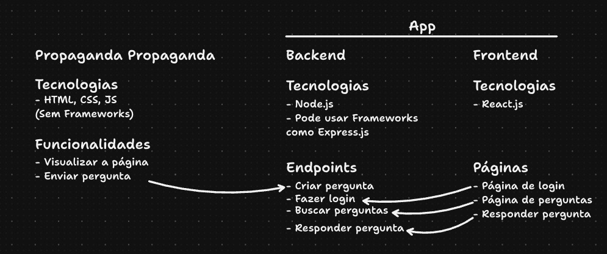

# Projeto de Avaliação Técnica - Oracclum

## Filme escolhido --> Velozes & Furiosos 5: Operação Rio

<p align="center">
  
</p>

Este repositório contém um projeto desenvolvido como parte de uma avaliação técnica. O projeto é composto por uma aplicação web construída com React + Vite e uma API Node.js utilizando Express e Firebase Firestore.

## Responsividade
### Até (`800px`)
Como o projeto não foi hospedado por ter React e páginas estáticas misturadas, a responsividade foi feita até 800px por só rodar em PC.

## Estrutura do Projeto

### 1. Página de Propaganda (`public`)
A pasta `public` contém uma página estática que não utiliza nenhum framework. Essa página não faz parte da aplicação React, porém faz parte das rotas protegidas (O que não faz sentido, mas esse projeto é para testes, e essa página vanilla era um requisito).

### 2. Aplicativo React + Vite
O restante do projeto foi desenvolvido utilizando **React** com **Vite**. As funcionalidades incluem:

- Rotas protegidas para controle de acesso.
- Integração com Firebase Authentication para autenticação de usuários.
- Integração com uma API para gerenciamento de perguntas e respostas.

### 3. API Node.js (pasta `api`)
A API foi desenvolvida utilizando **Express.js** e armazena os dados no **Firebase Firestore**. Funcionalidades principais:

- Criar perguntas. (/questions - POST)
- Listar perguntas. (/questions - GET)
- Adicionar respostas a perguntas existentes. (/questions/:id/answers - POST)

## Como Rodar o Projeto Localmente

### Requisitos:
- Node.js instalado
- Gerenciador de pacotes `npm`

### Passo a Passo:

#### 1. Rodando a API
```sh
cd api
npm install  
npm run dev  # Inicia a API localmente na porta 5000
```

#### 2. Rodando o Frontend
```sh
npm install  
npm run dev  # Inicia a aplicação React localmente
```

A aplicação estará disponível em `http://localhost:5173` (por padrão do Vite).

## Considerações Finais
Este projeto foi desenvolvido com foco em boas práticas de desenvolvimento, incluindo:
- Uso de **Context API** para gerenciamento de autenticação.
- Proteção de rotas baseada no estado de login do usuário.
- Validação de formulários com `react-hook-form` e `zod`.
- Integração eficiente com Firebase Firestore para armazenamento de perguntas e respostas.
